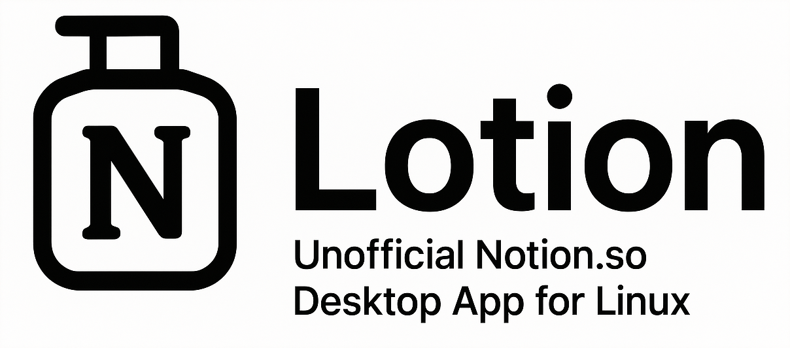
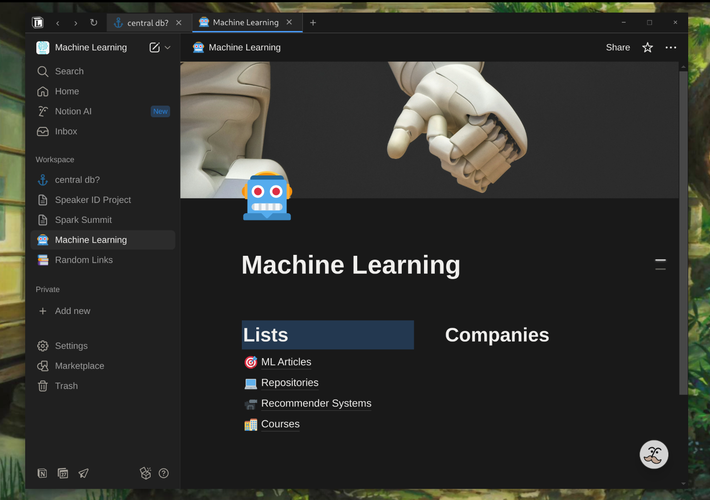
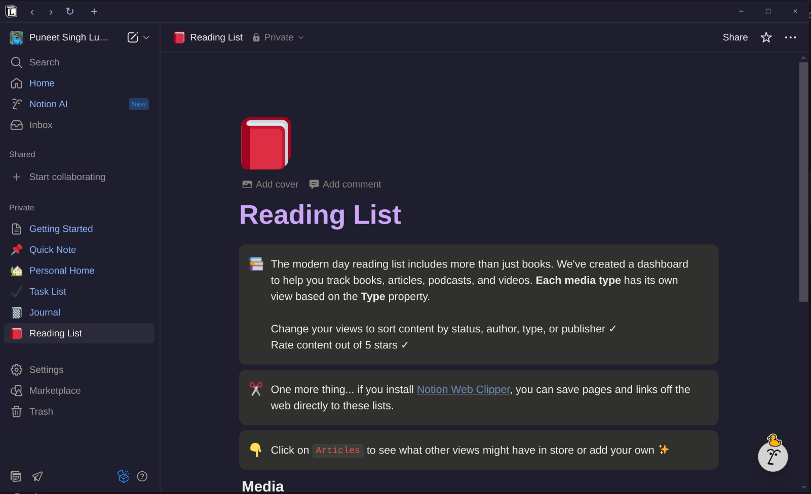

<p align="center">
  
</p>

<p align="center">
  <a href="https://github.com/sponsors/puneetsl"></a>
  
  
  
  
</p>

---

<div align="center">
<table><tr><td>
<strong>💖 Like Lotion?</strong> &nbsp;Consider <a href="https://github.com/sponsors/puneetsl">sponsoring on GitHub</a> to keep this and other Linux tools alive.
</td></tr></table>
</div>

## What is Lotion?

Lotion is an unofficial, Electron-based desktop client for [Notion.so](https://www.notion.so), focused on Linux. Notion has historically not prioritized native Linux support:

> *"Hey we don't want to release on platforms that we cannot ensure the quality – the team is still small and we don't use Linux ourselves"*
> — Notion ([@NotionHQ](https://twitter.com/NotionHQ))

Lotion fills that gap with a modern multi-tab UI, theming, spell check, and the kind of desktop integration you'd expect from a native app.

<p align="center">
  
</p>

> **New to Notion?** Sign up [here](https://www.notion.so/?r=55d4c384b54a457490f6cc1799bedc76) and try it out.

---

## Features

### Window & tabs
- **Frameless window** with custom 32px title bar and integrated tab bar
- **Multi-tab** with click-to-switch, drag-and-drop reordering, pinning, dynamic titles, and favicon support
- **Tab overflow**: tabs shrink Chrome-style; once shrunk, mouse-wheel scrolls horizontally with subtle fade indicators showing hidden tabs
- **Navigation controls** (back, forward, refresh) integrated into the tab bar
- **Session restore** *(opt-in)* — quitting with tabs open restores them on next launch
- **Native window decorations** *(opt-in)* — swap the custom frameless tab bar for your DE's window chrome + standard menu bar (single tab per window in this mode)

### Theming
- **10 built-in themes**: Default, Dracula, Nord, Gruvbox Dark, Monokai, Noir, Catppuccin Mocha / Macchiato / Frappe / Latte, Sakura
- **System-theme sync**: picking a light theme (Sakura, Latte) auto-flips Notion's "use system setting" appearance to light; dark themes flip it back to dark
- **Unified theming** — the tab bar matches whatever theme you pick
- **Custom CSS** support — drop your own theme into `~/.config/Lotion/themes/<name>.css`

### Other
- **Spell check** — right-click misspelled words for suggestions; multi-language support (toggle from logo menu)
- **External links** open in your default browser
- **Zoom**: `Ctrl + +` / `Ctrl + =` / `Ctrl + -` / `Ctrl + 0` work across keyboard layouts (Spanish, German, etc.) — not just US

---

## Themes

Click the Lotion logo (top-left) → **Theme** to pick one. Light/dark mode flips automatically to match the theme intent.

<p align="center">
  
  <br><em>Catppuccin Mocha — tab bar and page content share the palette</em>
</p>

| Dark | Light |
|---|---|
| Dracula | Catppuccin Latte |
| Nord | Sakura |
| Gruvbox Dark | |
| Monokai | |
| Noir | |
| Catppuccin Mocha | |
| Catppuccin Macchiato | |
| Catppuccin Frappe | |

### Custom themes

Drop a CSS file at `~/.config/Lotion/themes/<name>.css`. To target Notion's content, override its `--c-*` custom properties on the right selectors:

```css
/* Example: a teal-accented dark override.
   Notion declares --c-* on .notion-dark-theme (on <body>), so the
   override has to land on that selector (not just :root) — and
   !important wins over Notion's own redeclarations. */
:root,
:root.dark,
:root.light,
body,
body.notion-body,
.notion-dark-theme,
.notion-light-theme,
.notion-app-inner {
  --c-bacPri: #0f1419 !important;          /* page background */
  --c-bacSec: #0a0f14 !important;          /* sidebar / cards */
  --c-bacTer: #1c252e !important;          /* hover / elevated */
  --c-icoPri: #e8e8e8 !important;          /* primary text + icons */
  --c-icoSec: #45ada8 !important;          /* accent text + icons */
  --c-palUiBlu600: #45ada8 !important;     /* Notion's primary blue → your accent */
}
```

Then pick your theme from the logo menu, or pick **Reload Custom CSS** to re-inject after edits. Look at any file in [`assets/themes/`](./assets/themes/) for a complete template.

---

## Installation

### Arch Linux

> **Status:** the `lotion-bin` package isn't on the AUR yet. Build it locally from the PKGBUILD shipped in this repo — it downloads the official `.deb` artifact, so you get the same binary that ships in our GitHub release without running `npm install`.

```bash
git clone https://github.com/puneetsl/lotion.git
cd lotion
makepkg -si
```

The `lotion` command is installed to `/usr/bin/lotion`, and a desktop entry shows up in your launcher.

See [`PKGBUILD.md`](./PKGBUILD.md) for how the packaging works, or [`knol/AUR_SUBMISSION.md`](./knol/AUR_SUBMISSION.md) if you want to maintain it on the AUR.

### Debian / Ubuntu (`.deb`)

Grab the `.deb` from [the latest release](https://github.com/puneetsl/lotion/releases/latest) and install:

```bash
sudo apt install ./lotion_1.6.0_amd64.deb
# (apt handles missing dependencies automatically)
```

### Fedora / RHEL (`.rpm`)

```bash
sudo dnf install ./lotion-1.6.0-1.x86_64.rpm
```

### Portable / other distros (`.zip`)

Download `Lotion-linux-x64-1.6.0.zip` (or `arm64`) from [the latest release](https://github.com/puneetsl/lotion/releases/latest), extract, and run the `lotion` binary inside.

### macOS / Windows

Lotion's primary target is Linux, but the build does produce macOS `.zip` and Windows `.exe`/`.zip` artifacts on every release. Use at your own risk — most testing happens on Linux.

### From source (development)

```bash
git clone git@github.com:puneetsl/lotion.git
cd lotion
npm install
npm start            # runs in dev mode
npm run make:linux   # builds .deb / .rpm / .zip into out/
```

---

## Keyboard shortcuts

| Action | Shortcut |
|---|---|
| Zoom in | `Ctrl + =` or `Ctrl + +` |
| Zoom out | `Ctrl + -` |
| Reset zoom | `Ctrl + 0` |
| Back | `Alt + Left` |
| Forward | `Alt + Right` |
| Refresh | `Ctrl + R` |
| Home (open notion.so root) | `Ctrl + H` |
| Preferences | `Ctrl + ,` |
| Quit | `Ctrl + Q` |
| Toggle DevTools (dev mode) | `Ctrl + Shift + I` / `F12` |

The zoom shortcuts use the `=` key rather than the `+` symbol, so they work consistently across keyboard layouts.

---

## Configuration

User data and preferences live in:

- **App config**: `~/.config/Lotion/config.json`
- **Themes (user overrides)**: `~/.config/Lotion/themes/<name>.css`
- **Custom CSS injection**: `~/.config/Lotion/custom.css`
- **Logs**: `~/.config/Lotion/logs/main.log`
- **Cache**: `~/.cache/Lotion/`

Most preferences are toggled from the logo popup menu (top-left), including theme selection, spell check, "Restore Tabs on Startup", and "Use Native Window Decorations".

---

## Development

```
lotion/
├── src/
│   ├── main/                       # Electron main process
│   │   ├── controllers/            # AppController, WindowController, TabController
│   │   ├── managers/TabManager.js
│   │   ├── store/                  # Redux store + slices (tabs, windows, app)
│   │   ├── index.js                # Main entry: menus, IPC, app lifecycle
│   │   └── spellCheckMenu.js
│   └── renderer/
│       ├── preload.js              # Main preload (context bridge)
│       └── tab-bar/                # Custom tab bar (vanilla JS)
│           ├── index.html
│           ├── renderer.js
│           └── preload.js
├── assets/
│   ├── themes/                     # Bundled theme CSS (Dracula, Nord, ...)
│   ├── icons/                      # Multi-size app icons
│   └── lotion.desktop              # Linux .desktop entry
├── config/config.json              # Build-time config (Notion base URL)
├── i18n/                           # Locale strings
└── PKGBUILD                        # Arch lotion-bin package
```

**Stack**: Electron 41 + Electron Forge 7 (build/packaging), Redux Toolkit (state in the main process), vanilla JS for the tab bar (no React in the renderer), React 18 available for future UI work.

**Tab architecture**: each tab is a `WebContentsView` parented to a single `BrowserWindow`. The tab bar lives in a separate `WebContentsView` at the top of the window. Redux state in the main process is the source of truth; the renderer subscribes via IPC events.

### Useful scripts

```bash
npm start             # dev mode
npm run package       # build app bundle (no installer)
npm run make:linux    # build .deb + .rpm + .zip for Linux
npm run make          # build all platform targets
```

### Debugging the theme system

If a future Notion update changes CSS variable names, dump the current set:

```bash
LOTION_DUMP_VARS=1 npm start
# Then check ~/.config/Lotion/logs/main.log for [CSS DUMP] lines
```

---

## Contributing

PRs welcome. The flow:

1. Fork → branch from `master`
2. Make changes, test on Linux
3. Commit and open a PR

Bug reports, theme submissions, and small UX polish are all good first contributions. See open issues for ideas.

For AUR package maintenance: see [`knol/AUR_SUBMISSION.md`](./knol/AUR_SUBMISSION.md).

---

## Uninstall

```bash
# Arch
sudo pacman -R lotion-bin

# Debian/Ubuntu
sudo apt remove lotion

# Fedora/RHEL
sudo dnf remove lotion

# Portable: just delete the extracted directory.

# Also remove user data (optional):
rm -rf ~/.config/Lotion ~/.cache/Lotion
```

---

## Acknowledgments

- [sysdrum/notion-app](https://github.com/sysdrum/notion-app) — inspiration and early reference implementation
- Notion-enhancer community (now archived) — pioneered CSS theming for Notion

## License

MIT (see [`LICENSE`](./LICENSE)). For personal and educational use — please respect Notion's terms of service.

## Disclaimer

This is an unofficial Notion client. It is not affiliated with, endorsed by, or supported by Notion Labs, Inc.

---

## Support

- [Report a bug](https://github.com/puneetsl/lotion/issues/new)
- [Discussions](https://github.com/puneetsl/lotion/discussions)

---

<sub>Also from the author: <a href="https://memodiction.com/">Memodiction.com</a> — a dictionary that helps you remember words.</sub>

<p align="center">Made for the Linux community.</p>
