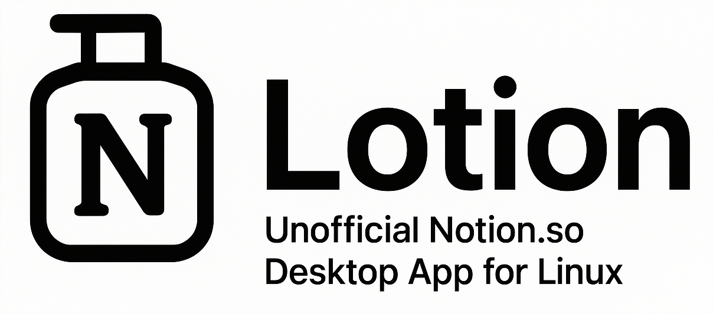

<p align="center">
  
</p>

<p align="center">
  
  
  
  
</p>

---

## Introduction

Lotion is an unofficial Electron-based desktop application that brings Notion.so to Linux. While NotionHQ continues to focus on feature development for other platforms, Linux support remains a lower priority. This project aims to fill that gap by providing a native desktop experience with modern UI and comprehensive features.

<blockquote>
"Hey we don't want to release on platforms that we cannot ensure the quality – the team is still small and we don't use Linux ourselves"
<br>— Notion (@NotionHQ)
</blockquote>

### Application Preview

<p align="center">
  
</p>

> **First time hearing about Notion?**
>
> Use this [link](https://www.notion.so/?r=55d4c384b54a457490f6cc1799bedc76) to sign up and get ready to manage your life like you have never managed before!

---

## Features

### User Interface
- **Frameless Window Design** - Modern, seamless interface with custom title bar
- **Tab Management** - Multiple tabs with drag-and-drop reordering, pinning, and favicon support
- **Navigation Controls** - Integrated back, forward, and refresh buttons
- **Built-in Themes** - 8 beautiful themes including Dracula, Nord, Gruvbox, and Catppuccin variants
- **Dark Mode Support** - Automatic theme detection and switching
- **Logo Menu** - Quick access to themes, project links, and GitHub repository

### Core Functionality
- **Full Notion.so Integration** - Complete access to all Notion features on Linux
- **Native Linux Desktop Integration** - Proper icon support and system integration
- **Cross-platform Compatibility** - Linux, macOS, and Windows support

### Navigation & Interaction
- **Context Menu** - Right-click menu with Cut, Copy, Paste, Select All, and link handling
- **External Links** - Automatically open links in default browser

### Spell Check
- **English Language Support** - Built-in spell checking for English (US)
- **Real-time Suggestions** - Right-click on misspelled words for suggestions
- **Custom Dictionary** - Add words to your personal dictionary

### Architecture
- **Modern Electron Stack** - Built with Electron 34.3.2 and Electron Forge
- **Redux State Management** - Centralized state for tabs, windows, and preferences
- **WebContentsView API** - Efficient multi-tab implementation
- **Multiple Package Formats** - DEB, RPM, and ZIP packages
- **Multi-architecture** - x64 and ARM64 builds available

---

## Themes

Lotion includes beautiful built-in themes that transform Notion's appearance while keeping content readable. Access themes via the Lotion logo menu in the top-left corner.

<p align="center">
  
  <br>
  <em>Catppuccin Mocha theme with synchronized tab bar</em>
</p>

### Available Themes

- **Default (Notion)** - Uses Notion's default theme with system-aware tab bar
- **Dracula** - Popular dark theme with purple and cyan accents
- **Nord** - Arctic, north-bluish color palette
- **Gruvbox Dark** - Retro groove colors with warm earth tones
- **Catppuccin Mocha** - Warm dark theme with purple accents (shown above)
- **Catppuccin Macchiato** - Slightly lighter than Mocha
- **Catppuccin Frappe** - Cool dark theme with blue tones
- **Catppuccin Latte** - Light theme option for bright environments

### Theme Features

- **Unified Theming** - Both page content and tab bar match the selected theme
- **Minimal Design** - Themes style UI chrome (sidebar, topbar) while preserving content readability
- **Instant Switching** - Change themes on the fly without restarting
- **Custom CSS Support** - Add your own themes to `~/.config/Lotion/themes/`
- **System Theme Integration** - Default theme respects your system's dark/light mode preference

### Creating Custom Themes

Create a new CSS file in `~/.config/Lotion/themes/your-theme.css`:

```css
/* My Custom Theme */
:root {
  --custom-bg: #1a1b26;
  --custom-accent: #7aa2f7;
}

.notion-frame,
body {
  background: var(--custom-bg) !important;
}

.notion-sidebar {
  background: var(--custom-bg) !important;
}

h1, h2, h3 {
  color: var(--custom-accent) !important;
}
```

Then select "Reload Custom CSS" from the logo menu to load your theme.

---

## Installation

### Arch Linux (AUR)

For Arch Linux users, install from the AUR:

```bash
# Using yay
yay -S lotion

# Using paru
paru -S lotion

# Using makepkg manually
git clone https://aur.archlinux.org/lotion.git
cd lotion
makepkg -si
```

#### Quick Install from Source

Alternatively, install directly from this repository with a one-liner:

```bash
bash <(curl -fsSL https://raw.githubusercontent.com/puneetsl/lotion/master/install-arch.sh)
```

Or download and review the script first:

```bash
curl -fsSL https://raw.githubusercontent.com/puneetsl/lotion/master/install-arch.sh -o install-arch.sh
bash install-arch.sh
```

**Important Notes for Arch Users:**
- The PKGBUILD downloads the complete source tarball which includes all assets (icons, desktop files, etc.)
- Do NOT add `icon.png` or other assets as separate source entries
- If you encounter a 404 error for `icon.png`, ensure you're using the latest PKGBUILD from this repository
- For detailed troubleshooting, see [PKGBUILD.md](PKGBUILD.md)

### Debian/Ubuntu (.deb package)

Download the latest `.deb` package from [Releases](https://github.com/puneetsl/lotion/releases):

```bash
sudo dpkg -i lotion_1.0.0_amd64.deb

# If you have dependency issues:
sudo apt install -f
```

### Fedora/RHEL (.rpm package)

Download the latest `.rpm` package from [Releases](https://github.com/puneetsl/lotion/releases):

```bash
sudo rpm -i lotion-1.0.0.x86_64.rpm

# Or using dnf:
sudo dnf install ./lotion-1.0.0.x86_64.rpm
```

### From Source

1. **Clone the repository:**
```bash
git clone git@github.com:puneetsl/lotion.git
cd lotion
```

2. **Install dependencies:**
```bash
npm install
```

3. **Run in development mode:**
```bash
npm run dev
```

### Build Packages

To build distribution packages:

```bash
# Build .deb package (recommended for Debian/Ubuntu)
npx electron-forge make --targets @electron-forge/maker-deb

# Build all Linux packages
npm run make:linux

# Packages will be in the 'out' directory:
# - .deb package (Debian/Ubuntu)
# - .rpm package (Red Hat/Fedora/openSUSE)
# - .zip archive (universal)
```

### Install the .deb Package

```bash
sudo dpkg -i out/make/deb/x64/lotion_1.0.0_amd64.deb

# If you have dependency issues on non-Debian systems:
sudo dpkg -i --force-depends out/make/deb/x64/lotion_1.0.0_amd64.deb
```

### Portable Installation

For a portable install (no system installation required):

```bash
./portable.sh
```

---

## Configuration

The application stores configuration in `config/config.json`:

```json
{
  "domainBaseUrl": "https://www.notion.so"
}
```

User data and preferences are automatically saved in:
- **Linux**: `~/.config/Lotion/`

---

## Keyboard Shortcuts

### Navigation
Use the navigation buttons in the tab bar:
- Back button (‹) - Go back
- Forward button (›) - Go forward
- Refresh button (↻) - Reload page

### Development
- `Ctrl+Shift+I` / `F12` - Toggle Developer Tools (dev mode only)

---

## Spell Check

Lotion includes built-in spell checking with support for English (US):

### How to Use:
1. Type text in any editable field in Notion
2. Right-click on any misspelled word (underlined in red)
3. Select from the suggested corrections
4. Or choose "Add to Dictionary" to remember the word

Spell check works automatically in all text fields and is always enabled.

---

## Development

### Project Structure

```
lotion/
├── src/
│   ├── main/
│   │   ├── controllers/      # WindowController, TabController, AppController
│   │   ├── store/            # Redux store & slices (tabs, windows, settings)
│   │   ├── index.js          # Main process entry point
│   │   └── spellCheckMenu.js # Spell check menu functionality
│   └── renderer/
│       ├── tab-bar/          # Custom tab bar UI (vanilla JS)
│       │   ├── index.html    # Tab bar HTML & CSS
│       │   ├── renderer.js   # Tab bar rendering logic
│       │   └── preload.js    # Tab bar IPC bridge
│       └── preload.js        # Main preload script
├── assets/                   # Application icons and images
├── config/                   # Configuration files
├── i18n/                     # Internationalization support
└── build.js                  # Build configuration script
```

### Development Scripts

```bash
npm run start      # Start in development mode
npm run dev        # Alias for start
npm run package    # Package the application
npm run make       # Create distribution packages
npm run make:linux # Create Linux-specific packages
```

### Architecture Overview

**Main Process**
- **AppController**: Application lifecycle and multi-window orchestration
- **WindowController**: Manages frameless windows with custom tab bars
- **TabController**: Individual tab lifecycle and WebContentsView management
- **Redux Store**: Centralized state for tabs, windows, and user preferences

**Renderer Process**
- **Tab Bar**: Custom vanilla JavaScript UI for tab management
- **Web Content**: Loads Notion.so web application in WebContentsView instances
- **IPC Bridge**: Secure communication between main and renderer processes

**Key Technologies**
- WebContentsView API for efficient tab rendering
- Electron context isolation for security
- Redux Toolkit for state management
- Native context menus with spell check integration

---

## Contributing

Contributions are welcome! Here's how you can help:

1. Fork the repository
2. Create a feature branch: `git checkout -b feature/amazing-feature`
3. Make your changes and test thoroughly on Linux
4. Commit your changes: `git commit -m 'Add amazing feature'`
5. Push to the branch: `git push origin feature/amazing-feature`
6. Open a Pull Request

### For Maintainers

If you're maintaining the AUR package, see [AUR_SUBMISSION.md](AUR_SUBMISSION.md) for detailed instructions on:
- Submitting to AUR for the first time
- Updating the package for new releases
- Testing and troubleshooting

---

## Acknowledgments

- Thanks to [sysdrum/notion-app](https://github.com/sysdrum/notion-app) for inspiration and initial code
- Built with Electron and modern web technologies

---

## License

This project is for educational and personal use. Please respect Notion's terms of service.

### Disclaimer

This is an unofficial adaptation of Notion's desktop application. It is not affiliated with, endorsed by, or supported by Notion Labs, Inc.

---

## Uninstall

### For .deb Package Installation

```bash
# Using dpkg
sudo dpkg -r lotion

# Or using apt
sudo apt remove lotion
```

### For .rpm Package Installation

```bash
# Using rpm
sudo rpm -e lotion

# Or using dnf/yum
sudo dnf remove lotion
# or
sudo yum remove lotion
```

### For Source/Portable Installation

Simply delete the application directory:

```bash
rm -rf /path/to/lotion

# Also remove user data (optional)
rm -rf ~/.config/Lotion ~/.cache/lotion
```

---

## Support

For issues and questions, please use the GitHub issue tracker:
- [Report a bug](https://github.com/puneetsl/lotion/issues)
- [Request a feature](https://github.com/puneetsl/lotion/issues)
- [Ask a question](https://github.com/puneetsl/lotion/discussions)

---

### Advertisement: [Memodiction.com](https://memodiction.com/)
*A dictionary that helps you remember words*

---

<p align="center">Made for the Linux community</p>
